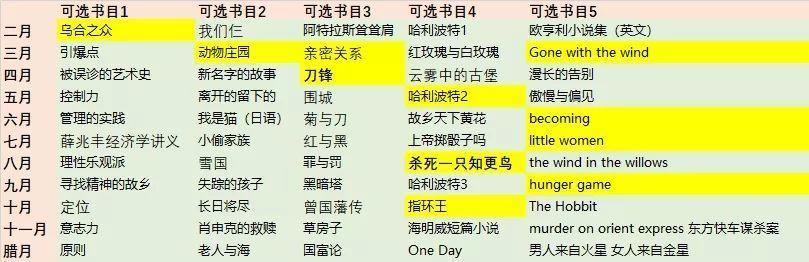
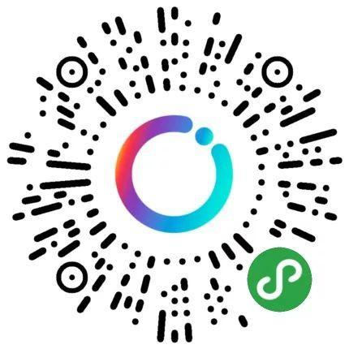

## 【读书群】2020年度安排
> 作者：六六（读书群群主）

搞活动似乎真的真需要契机。在读书群小伙伴的热情讨论中，2020年度阅读活动也初具雏形了。

### 活动时间
2020年2月1日至12月31日

### 活动奖励
#### 奖项一
*   每月阅读**指定书目**（至少11本）
*   按月完成读后笔记（至少11篇，每篇150字以上）
*   公众号指定帖子回复
*   全部完成即可拿奖

#### 奖项二
*   阅读**自选书目**（至少5本）
*   按月完成读后笔记（至少14篇，每本书籍不得超过3篇，每篇150字以上）
*   公众号指定帖子回复
*   全部完成即可拿奖

#### 奖项三
*   阅读自选书目（不限）
*   随时更新读后笔记（字数不限）
*   在**全民打卡小程序**中发帖
*   全年排名**前三**获奖

奖项相互不兼得

### 指定书目

每月五选一即可

该书单，阅读语种不限，里面的高亮并无特别含义～

### 活动细则

奖项一，该类主要针对没有自己的阅读计划，但又希望2020年的自己能阅读些书的同学

奖项二，该类主要针对有自己阅读计划的同学。毕竟书单很难戳中每位同学的心，大家可自选书目。如果某些书很长很长，比如红楼梦，可以针对一本书写多篇笔记，但同一本书的读后笔记不超过3篇；也就是说，想要赢得这个奖项，还是需要至少阅读5本不同的书籍哦～

奖项三，在2020年度，在全民打卡小程序中打卡排名前三的同学。该类主要针对每天都会阅读，但阅读书目可能并不多的同学～不过，在刚刚结束的活动中，排名前三的同学，阅读量基本都很大，哈哈～

打卡小程序二维码如下，可扫码加入进入。

如果A同学同时获得多个奖项，只算一个奖不叠加。奖项一和奖项二可合并计算。即，如A同学有10个月都参与了活动一的阅读，写了10篇笔记。A同学还阅读了其他非书单的书籍们，写了4篇笔记。等到年末，A同学将获得奖励二。

规定书目的阅读笔记会在每月初，在公众号发帖。请参与的同学务必回复到这边的帖子里。必须要每篇150字以上~该类笔记当月截止，晚了就只能和最终的奖励失之交臂啦～

所以，画重点，年末统计大家是否全勤参与时，将以公众号里的笔记为准。同时，建议你加入读书群的微信，以便交流与最后的领奖。加入方法请看[【小组】微信群大集合](study/5.md)，根据机器人的要求回复指定关键词，可触发菜单栏加群。

### 奖品发放

首先，我们并不是一个毛爷爷富有的兴趣小组，年末的奖品，目前还没有着落。但是，我们已经有了初步想法～

1、向组织申请活动经费๑乛v乛๑嘿嘿～欢迎豪气的同学自愿赞助～

2、由群友捐书，邮寄给获奖者～组织来包邮～因为实在不知道等到年末，会有多少获奖的同学，所以，可能会买不起新书。群友说，有闲置的书可以贡献，于是乎，就有了这个方案～

3、我们相信，总会有办法的！

以上

感谢屏幕前的你读完了我的啰嗦介绍。如有疑问欢迎留言提出～