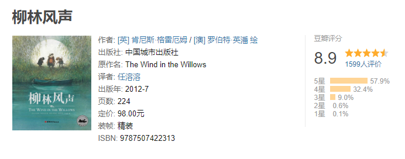

## 翻译安排
> 作者：洋阳（翻译群群主）

- 1月—3月：《Jane Eyre》，扇贝可读。
- 4月—6月：《The Wind in the Willows》，扇贝可读。
- 7月—9月：《The Shawshank Redemption》
- 10月—12月：《1984》

> 《简爱》讲述了这样一个故事：简•爱自幼父母双亡，投靠冷酷的舅母，但舅母无情地抛弃了她。她在一所慈善学校做了六年的学生和两年的教师。十八岁时，简•爱受聘到桑菲尔德府学当家庭教师，认识了主人罗切斯特。两人都被对方独特的气质和丰富的感情所吸引，于是不顾身份和地位的巨大差距深深相爱了。正当他们举行婚礼时，有人证明罗切斯特的前妻还活着。简•爱知道他们不可能有平等的婚姻，于是选择了离开。后来，简•爱意外遇见了她的表兄妹们，并从叔叔那里继承了一笔遗产。但她无法抵御对罗切斯特的刻骨思念，于是便回到了已经失去了财富、身体也遭到火灾严重摧残的罗切斯特身边，毅然跟他结婚。在爱的沐浴下，罗切斯特找回了幸福和健康。——摘自豆瓣

原版阅读链接：
http://novel.tingroom.com/html/book/show/13/list.html

> 这是一个爸爸写给儿子的童话，是一个适合围坐在暖暖的火炉边，大家一起听的故事。
> 书中以细腻典雅的笔调描绘了大自然风光的诗意变化，被誉为“英文散文体作品的典范”，而萦绕在柳林间的那一份友谊与温情，更是让人如沐春风。
> 鼹鼠丢下家里的大扫除，钻出地洞，兴高采烈地扑向外面清新的空气。不久，他就和他的几位朋友——懒散自在的兔子、行为粗鲁却为人和善的獾，以及自鸣得意且不负责任的癞蛤蟆——一起踏上了一段刺激、惊险的冒险之旅。在冲动的癞蛤蟆先生的率领下，这几个好朋友一次又一次，奋不顾身地投身于各种历险之中：从搅乱吉普赛车队到偷窃摩托车，再到后面大胆的越狱行径，最终，千锤百炼后的他们终于能像英雄那样，勇敢地直面外面大千世界中那些心思歹毒，阴险狡诈的各色人物。
> 这个趣味性十足的童话故事自问世之日起就一直深受读者们的喜爱，与此同时，它也是英国历史上最受欢迎的儿童文学作品之一。肯尼斯·格雷厄姆那精彩绝伦的想象和静谧无声的幽默吸引了无数的孩子和成年人。——摘自豆瓣

原版阅读链接：
http://novel.tingroom.com/shuangyu/259/list.html

> 这本书收入斯蒂芬·金的四部中篇小说，是他作品中的杰出代表作。其英文版一经推出，即登上《纽约时报》畅销书排行榜的冠军之位，当年在美国狂销二十八万册。目前，这本书已经被翻译成三十一种语言，同时创下了收录的四篇小说中有三篇被改编成轰动一时的电影的记录。
> 其中最为著名是曾获奥斯卡奖七项提名、被称为电影史上最完美影片的《肖申克救赎》（又译《刺激一九九五》）。这部小说展现了斯蒂芬·金于擅长的惊悚题材之外的过人功力。书中的另两篇小说《纳粹高徒》与《尸体》拍成电影后也赢得了极佳的口碑。其中《尸体》还被视为斯蒂芬·金最具自传色彩的作品。——摘自豆瓣

原版阅读链接：
http://novel.tingroom.com/html/book/show/37/list.html

> ★村上春树以《1Q84》向本书致敬
> ★著名学者刘绍铭经典译本内地首次出版
> ★62种文字风靡110个国家，全球销量超过5000万册
> ★《时代周刊》“最好的100本英语小说”
> ★兰登书屋“100本20世纪最佳英语小说”
> ★入选英美中学生必读书书目
> 1936年以来，我所写的每 一部严肃作品，都是直接或间接地反对极权主义，支持我所理解的民主社会主义。——乔治•奥威尔（《我为何写作》）
> 《1984》是一部杰出的政治寓言小说，也是一部幻想小说。作品刻画了人类在极权主义社会的生存状态，有若一个永不褪色的警示标签，警醒世人提防这种预想中的黑暗成为现实。历经几十年，其生命力益显强大，被誉为20世纪影响最为深远的文学经典之一。——摘自豆瓣

原版阅读链接：
http://novel.tingroom.com/shuangyu/257/list.html

## 参与要求

-   每周阅读原版章节
-   翻译100字左右
-   作业可参考  [翻译作业 || 第65期（简爱）](https://mp.weixin.qq.com/s/rY3m_mteW5yb420jlRAolw)
-   押金20元，不写作业者，扣押金，直接群内分给大家
-   微信群加入方式：[【小组】微信群大集合](study/5.md)

## 往期翻译

### 打卡记录

[【翻译群】打卡记录](https://docs.qq.com/sheet/DQ1lySW1VZnhDUmJN?c=J36A0Y0)

### 《Quora最佳问答》
[翻译周报 第1期](https://mp.weixin.qq.com/s/zMYBkbYPBKASzUanKjAs8g) Quora最佳问答：饮食&运动

[翻译周报 第2期](https://mp.weixin.qq.com/s/joNSgr30VE1RqUzjrdzikw) Quora最佳问答：饮食&运动

[翻译周报 第3期](https://mp.weixin.qq.com/s/3sQUcuxyaqp78P4us0rRow) Quora最佳问答：饮食&运动

### 《查令十字街84号》
[翻译周报 第4期](https://mp.weixin.qq.com/s/iyHIUWaxEWyxvzEZKvN9LQ)《查令十字街84号》首篇

[翻译周报 第6期](https://docs.qq.com/doc/BqI21X2yZIht1I07rl0P1Crk0xvnbd0jTiX34ZMB6F1cFiND2IQmKC2Cjyb92EWLMR4tVO1R0BiVxF1GCFw94)《查令十字街84号》

[翻译周报 第7期](https://docs.qq.com/doc/BqI21X2yZIht1I07rl0P1Crk0xWIEJ0r7ZxW1g16aI2yNp5W1IQmKC2Cjyb92wxfA30lONiI3PofJf2zBLkU2)《查令十字街84号》

[翻译周报 第8期](https://docs.qq.com/doc/BqI21X2yZIht1I07rl0P1Crk0qDTOM0z3Q4K2ykrlG226zIt1IQmKC2Cjyb92fSGk90DmHD82KCTWS4yYeuK0)《查令十字街84号》

[翻译周报 第9期](https://docs.qq.com/doc/BqI21X2yZIht1I07rl0P1Crk0tqoL54ng6961CfRLA3lW3R64IQmKC2Cjyb92CigXD2NeJ3M3TSEIz2vE0041)《查令十字街84号》

[翻译周报 第10期](https://docs.qq.com/doc/BqI21X2yZIht1I07rl0P1Crk0RuYYH4RjSqp2qD3yg2C7yTY4IQmKC2Cjyb92H2Iup3imiQ8071nFQ0vtfGG3) 《查令十字街84号》终篇

### 《高效能人士的七个习惯》
[翻译周报 第11期](https://docs.qq.com/doc/BqI21X2yZIht1I07rl0P1Crk0mSKma0cBzsc4f9C8Y4SMJWY0IQmKC2Cjyb92blLXc1qoOgV3Yv1u40GN6Wn1) 《高效能人士的七个习惯》 开篇）

[翻译周报 第12期](https://docs.qq.com/doc/BqI21X2yZIht1I07rl0P1Crk0fgmVk1jI5Kj12XRoA1Xf6la0IQmKC2Cjyb92wdolV2kat1G1jqKR31DfP581) 《高效能人士的七个习惯》（习惯一：积极主动——个人愿景的原则）

[翻译周报 第13期](https://docs.qq.com/doc/BqI21X2yZIht1I07rl0P1Crk0fTymO42gnlM46AtPz28blzH0IQmKC2Cjyb92hQBRR32y9cB1P3Qln2M3dp14) 《高效能人士的七个习惯》（习惯二：以终为始——自我领导的原则）

[翻译周报 第14期](https://docs.qq.com/doc/DdlBLaXljZ2pzc25I) 《高效能人士的七个习惯》（习惯三：要事第一 ——自我管理的原则）

[翻译周报 第15期](https://docs.qq.com/doc/Dc1VNbGVFZUtBd1d4) 《高效能人士的七个习惯》（名句篇）

### 《地球上好玩的地方》
[翻译周报 第16期](https://docs.qq.com/doc/DT052S0FvbGtPTEJQ) 《地球上好玩的地方》（到了蒙古才知道—上）

[翻译周报 第17期](https://docs.qq.com/doc/DcGJwdWZXZ3lSQnpO) 《地球上好玩的地方》（到了蒙古才知道—下）

### 《疯狂动物城》
[翻译周报 第18期](https://docs.qq.com/doc/DQ3VyanJxYnBIWG5i)《疯狂动物城》（字幕翻译—1）

[翻译周报 第19期](https://docs.qq.com/doc/DQ0tJcmFVTnBRTW5P)《疯狂动物城》（字幕翻译—2）

[翻译周报 第20期](https://docs.qq.com/doc/DQ2JidXNnZVFHeUFW)《疯狂动物城》（字幕翻译—3）

[翻译周报 第21期](https://docs.qq.com/doc/DQ3dnVHVaQmhyZEtn)《疯狂动物城》（字幕翻译—4）

[翻译周报 第22期](https://docs.qq.com/doc/DQ0twT1RIVWlYbGxx)《疯狂动物城》（字幕翻译—5）

[翻译周报 第23期](https://docs.qq.com/doc/DQ1lMeW9TT2NSVWZs)《疯狂动物城》（字幕翻译—6）

[翻译周报 第24期](https://docs.qq.com/doc/DQ2JUd1hId2dUR3JX)《疯狂动物城》（字幕翻译—7）

### 《Flipped》
[翻译周报 第25期](https://docs.qq.com/doc/DQ0hJeW93YUlqdkRq)《Flipped》

[翻译周报 第26期](https://docs.qq.com/doc/DQ3dnYWpTUE9IanVM)《Flipped》

[翻译周报 第27期](https://docs.qq.com/doc/DQ2d5dlpoWG50d0pv)《Flipped》

[翻译周报 第28期](https://docs.qq.com/doc/DQ3F4ek9TQW1KUkZZ)《Flipped》

### 《经济学人》
[翻译周报 第32期](https://www.shanbay.com/team/thread/44584/3132123/) 《经济学人-流浪地球》

### 《哈利波特与魔法石》
[翻译周报 第34期 ](https://www.shanbay.com/team/thread/44584/3136540/) 《哈利波特与魔法石》 短语+单词

[翻译周报 第35期 ](https://www.shanbay.com/team/thread/44584/3136542/)《哈利波特与魔法石》 语法

[翻译周报 第36期 ](https://www.shanbay.com/team/thread/44584/3136543/)《哈利波特与魔法石》 翻译

[翻译周报 第37期 ](https://www.shanbay.com/team/thread/44584/3136544/)《哈利波特与魔法石》 主观题

### 《动物庄园》 
[翻译作业 第48期](https://www.shanbay.com/team/thread/44584/3183886/)《动物庄园》 

[翻译作业 第49期](https://www.shanbay.com/team/thread/44584/3184956/)《动物庄园》 

[翻译作业 第50期](https://www.shanbay.com/team/thread/44584/3186145/)《动物庄园》 

[翻译作业 第51期](https://www.shanbay.com/team/thread/44584/3186982/)《动物庄园》 

[翻译作业 第52期](https://www.shanbay.com/team/thread/44584/3188080/)《动物庄园》 

[翻译作业 第53期](https://www.shanbay.com/team/thread/44584/3188854/)《动物庄园》 

[翻译作业 第54期](https://www.shanbay.com/team/thread/44584/3189716/)《动物庄园》 

[翻译作业 第55期](https://www.shanbay.com/team/thread/44584/3190575/)《动物庄园》 

[翻译作业 第56期](https://www.shanbay.com/team/thread/44584/3191442/)《动物庄园》 

[翻译作业 第57期](https://www.shanbay.com/team/thread/44584/3192245/)《动物庄园》 

### 《简爱》
[翻译作业 第58期](https://www.shanbay.com/team/thread/44584/3194609/)《简爱》

[翻译作业 第59期](http://mp.weixin.qq.com/s?__biz=MzI5OTI4MzEwMQ==&mid=2247484956&idx=1&sn=22f0209f37020af1afb2b1bc434a40a6&chksm=ec99a1eedbee28f83146536ff73ba73745a8837f6885289a574762f434845ebb401d72bc1e47&scene=21#wechat_redirect)《简爱》

[翻译作业 第60期](http://mp.weixin.qq.com/s?__biz=MzI5OTI4MzEwMQ==&mid=2247484992&idx=3&sn=05790371cd5b11a30b43bfe48779140c&chksm=ec99a1b2dbee28a430f7f2b15e8b2ee75bdda628f358add997e8e59709fd3e12e7f509a58f4e&scene=21#wechat_redirect)《简爱》

[翻译作业 第61期](http://mp.weixin.qq.com/s?__biz=MzI5OTI4MzEwMQ==&mid=2247484994&idx=1&sn=46da978bbd43daab7a06e1bbd312282e&chksm=ec99a1b0dbee28a634ec1960ff4a2ad64beadb8ee8b816f995e7fd0ba4a35275eb1b2335f68e&scene=21#wechat_redirect)《简爱》

[翻译作业 第62期](http://mp.weixin.qq.com/s?__biz=MzI5OTI4MzEwMQ==&mid=2247485003&idx=1&sn=a59f2f51e8271ded346b6802d8148dbf&chksm=ec99a1b9dbee28af7d065c51ff6a38797ce4ad934472178f8d540b8c0deb5da554815f7224fd&scene=21#wechat_redirect)《简爱》

[翻译作业 第63期](http://mp.weixin.qq.com/s?__biz=MzI5OTI4MzEwMQ==&mid=2247485012&idx=1&sn=9ecfc72126f87e415aba31d84f183f37&chksm=ec99a1a6dbee28b0b5d70eaca74960a9c0fc0eeee2494066af84395c0d37a0fdbca8499a52cb&scene=21#wechat_redirect)《简爱》

[翻译作业 第64期](http://mp.weixin.qq.com/s?__biz=MzI5OTI4MzEwMQ==&mid=2247485013&idx=1&sn=74006da65c6d9d4de59f6018ceba238a&chksm=ec99a1a7dbee28b1c4949e8c94b68fd90e2c00f8fe4d4d7cb5759e28b9c1e3c678f58e9b0ac2&scene=21#wechat_redirect)《简爱》

