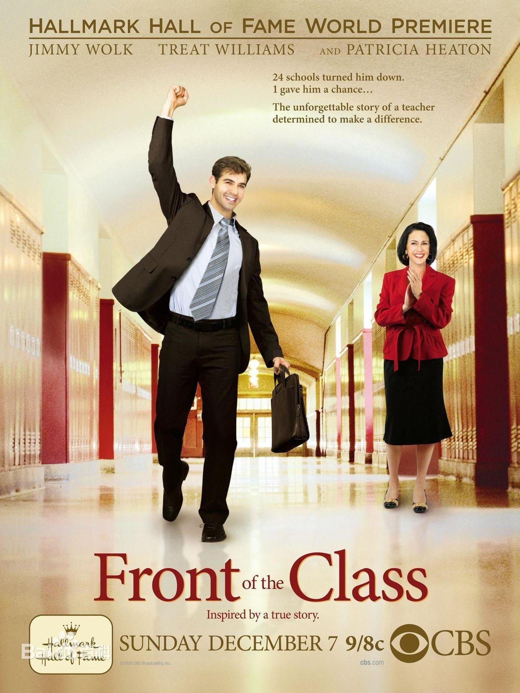
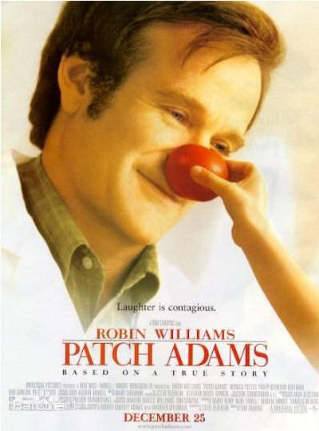

## Front of the Class

叫我第一名

(真人事迹改编)

### Lea

I have no choice to prove that Tourette's would never get the best of me .If I quit ,I would be agreeing with everyone who had ever told me I was barking up the wrong tree .

<audio id="audio" controls="" preload="none"> <source id="mp3" src="2.assets/Lea.m4a"> </audio>

### Bean

You have a gift to teach ,and it's not in spite of your Tourette's ,it's because of it .

<audio id="audio" controls="" preload="none"> <source id="mp3" src="2.assets/Bean.m4a"> </audio>

### Mubries

Coping with my Tourette's has taught me the most valuable lesson that anyone could ever learn ,and that is to never let anything stop you from chasing you dream ,from working or playing or falling in love .

<audio id="audio" controls="" preload="none"> <source id="mp3" src="2.assets/Mubries.m4a"> </audio>

## Something the lord made

神迹

### Rainshine

It is not about the world, it is about you.

<audio id="audio" controls="" preload="none"> <source id="mp3" src="2.assets/Rainshine.mp3"> </audio>

### Viola

It is not about you, it is about the work.

<audio id="audio" controls="" preload="none"> <source id="mp3" src="2.assets/Viola.mp3"> </audio>

## Patch Adams

妙手情真

### Jude

See what no one else sees. See what everyone chooses not to see... out of fear, conformity or laziness. See the whole world anew each day!

<audio id="audio" controls="" preload="none"> <source id="mp3" src="2.assets/Jude.acc"> </audio>

### Winter

Death is not the enemy gentlemen. If we're going to fight a disease, let's fight one of the most terrible diseases of all, indifference.

<audio id="audio" controls="" preload="none"> <source id="mp3" src="2.assets/Winter.m4a"> </audio>

### Yoge

Our job is improving the quality of life, not just delaying death.

<audio id="audio" controls="" preload="none"> <source id="mp3" src="2.assets/Yoge.m4a"> </audio>

### Vivienne

"All of life is coming home.

Salesmen, secretaries, coalminers, beekeepers-- all of us.

All the restless hearts of the world... all trying to find a way home.

It's hard to describe what I felt like then.

Picture yourself walking for days in a driving snow.

You don't even know you're walking in circles-- the heaviness of your legs in the drifts; your shouts disappearing into the wind.

How small you can feel.

How far away home can be.

Home.

The dictionary defines it as both a place of origin... and a goal or destination. "

<audio id="audio" controls="" preload="none"> <source id="mp3" src="2.assets/Vi.mp3"> </audio>

## Awakenings

无语问苍天

(真人事迹 同名回忆录改编)

### Grit

We are busy with finding the significance of our lives every day, but we forget that just living is significant.

<audio id="audio" controls="" preload="none"> <source id="mp3" src="2.assets/Grit.mp3"> </audio>

## Contagion

传染病

### Bruce

Nothing spread like fear.

Jessmine  I think what Mr. Kumwiede is spreading far more dangerous than the disease.

<audio id="audio" controls="" preload="none"> <source id="mp3" src="2.assets/Bruce.m4a"> </audio>

### Jessmine

I think what Mr. Kumwiede is spreading far more dangerous than the disease.

<audio id="audio" controls="" preload="none"> <source id="mp3" src="2.assets/Jesmine.m4a"> </audio>