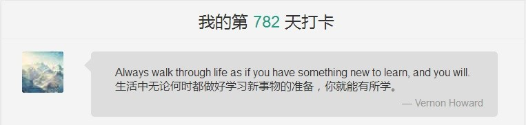
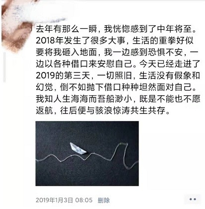

## 写在我打卡的第782天——如何与学习相处 

> 作者：[Sekoan](https://www.shanbay.com/user/list/wechat_l3zlqk94/)

首先感谢洋阳同学的邀请，真是一个充满正能量元气满满的好同学，正因深受其热情的感染，才有一次次机会更深入接触小组的方方面面。

在2017年9月24日，我下载了扇贝这个app，抱着试一试的心态，重拾起多年不碰的英语。然后竟能一直连续学习打卡到今天，这是我当初始料未及的。

当时正值27岁的我，参加了五次司法考试都没通过。工作三年也平平无奇，并未有什么太大起色。老婆怀了孩子，将在2018年出生。虽然这个岁数还称不上是中年，但中年的无力与焦虑感已然牢牢占据了我的生活。我也明白凡人的生活难免平淡，但总是心有不甘。既然距离30岁还略有时日，还是应该努力一下，不要给自己青春的尾巴留下遗憾。

考研，是我17年当时给自己定下的目标。报名考试的时候我自己心里也没底，老婆知道了我要考研的想法跟我说：“如果你要考研，我就给你这一次机会，如果考不过你也不要浪费时间。我们的孩子明年就要出生，你就安安心心带孩子。”老婆跟我是大学同学，深知我并不是什么读书的料，虽然大学没有挂科，但也多数是勉强及格。大二的时候靠着高中学的英语老本，考过了大学4级，430分不到，贴地飞行。我从小英语不好，当时过了4级就再也没想过英语的事情，我当时以为我这辈子以后再也不会碰英语了。因为大学读的是法律专业，所以也连续尝试了5次司法考试，花费了不少时间和金钱，但结果都是非常不理想，距离及格线可差的太远了。“也许又要再走一次过场，安心接受自己中年生活的到来”我当时心里是这么想的。

考研英语对我来说是个难题，本来英语就不行还好几年没碰，现在不仅是要笔试过线，之后还有英语口试。然后在应用商店里一阵搜索，看到了扇贝单词，那就下了试试，界面也干净也不收费，就每天背50个单词吧。就这样每天打卡坚持到了考试结束，虽然每天都是再认50个，其实也花不了多少时间，但对于脱离英语太久的我还是有些费劲的。走出考场的那天我也在想是不是要放弃打卡，毕竟考试已经结束了。但是看看当时连续打卡几十天的界面，觉得自己一路走来也挺不容易的，就这样放弃了挺可惜的。而且从理性的角度来说，每天学点英语挺好的，只是我个人情感上对英语很排斥，仔细想想也就是因为自己英语不好才不喜欢的吧。

后来很意外的笔试过线了，自己都没想到。英语虽然分数不高，但是过了及格线，另一张卷分数还行，总分过了录取线10分多一点。紧接着就是要准备面试和英语口试的事情，太难了，读写都搞不清的我要在面试这么紧张的环境下英语回答问题。但因为笔试分数过线其实不算太多，所以如果面试成绩不好很容易前功尽弃。那就硬着头皮上吧，毕竟留给我的机会已经所剩无几了。每天用扇贝背100个单词，打开了听词模式，算是提升一点听说水平。自己准备了一些面试可能会要用到的回答，各种翻译软件反复对比，再找了身边同学帮忙修改，反复背诵。感觉自己从来没有这么认真学过英语，因为我未曾如此迫切地需要过英语给我带来的机会。

所幸的是这些努力都没有白费，在离开校园的6年后，我又拿到了学生证，成为了一名在职研究生。这极大的强化了我学习的动力，以前总听别人说学习改变命运，直到我亲身经历了这样的转变。用扇贝学英语打卡的习惯也就一并保留了下来，一方面是我的生活收益于此，另一方面也是因为研究生毕业需要大学英语六级才能申请学位证书。读研之后考了两次6级，第一次366，第二次401，还有一个月不到我就要参加第三次6级考试，希望这次顺利通过，可以分配更多的学习精力到论文写作上来。

这是我在2019年年初写的朋友圈，现在已经是2019年的年末，一年来每天生活安排的满满当当，早上5点多起来先把英语学了，报名了扇贝的四六级训练营，每天大概花上个1小时左右。然后给孩子喂奶换尿片，跟老婆一起手忙脚乱的把孩子送到父母家去，再各自去上班。工作上也有了些许起色，当上了一个小领导，承担起了更多的责任，工作也变得更加忙碌了。午休内容也从午睡改成了健身，每个工作日，每天2小时。晚上下了班先把小孩接回家，收拾收拾把孩子哄睡，再坚持每天练一页字，看几页书写一点读书笔记。10点左右睡觉，学着别人做一个早睡早起的中年人。

现在我已经是同事朋友眼中爱学习的中年人了。从以前满脑子游戏的学渣，到现在把游戏时间全部用来学习。一开始或许是咬牙坚持，但现在只是如同吃饭喝水般稀松平常的事情。真的是要以一种平常心来看待学习这件事，以前就是把学习看的太重，好像既然是学习就一定要有什么成果，一定要定定心心一整本经的坐在书桌前，今天不研究出什么学习成果绝不善罢甘休。结果是物极必反，反倒产生了强烈的排斥心理，学了老半天也没学出什么名堂，大概自己不是学习的料，要不就不要学习了，免得自取其辱。但其实学习不像打游戏，没有这么多的即时反馈，你需要持续一段时间的学习才能在自己身上看到效果。但学习成果给你带来的快乐是真实而饱满的，因为社会对学习的评价一致很高。而打游戏就不是如此，虽然反馈很及时，仿佛你每一秒操作都使你变得更强。但社会对游戏成果的评价却是褒贬不一，也许在圈内是大神，可放到家庭和单位里，便成了彻头彻尾的不务正业。回顾自己过往的生活，正是这种不稳定的获得感使我的生活陷入深深的自我矛盾与空虚。

写在最后的是，命运真是的可以由我们自己掌控的吗？如果可以，我们将会以什么样的方式来改变它的走向？或许能否生活在这个通过学习可以大概率改变命运的时代是天命所定，但身处这个时代的我们是否愿意为学习付出努力来改变命运，那就是我们自己决定的了。