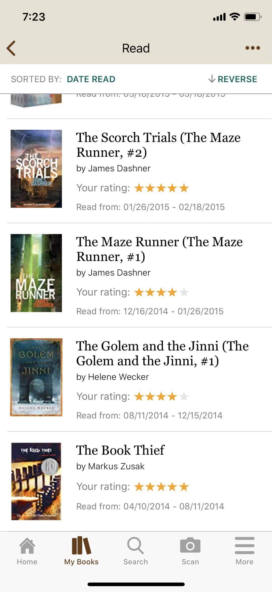
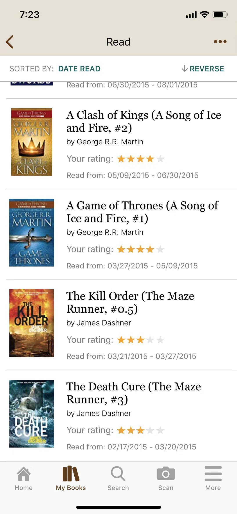
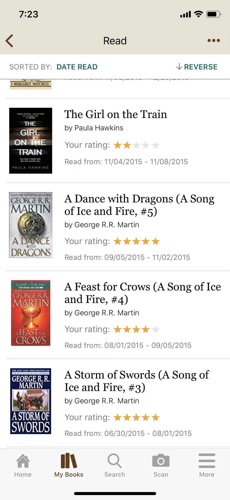

## 请将原著作为第一选择

> 作者：Vivienne 

不知正在努力学习英语的您，究竟读过多少本原著呢？ 趁大家思考这晌，我先来说说自己的英语背景吧，没时间的小伙伴可直接跳到下一节（该如何读原著）：

我不是英语大神，英语甚至可称为我学生时期的短板。有多短，十五道单选题错十三道，就是这么短。 毕业于普通大学，后有机会赴美留学读研，但也是很普通的学校；当时只抱着出去见见世面的心态，打算读完就回国。 那么到底是什么改变了我对英语的看法和态度？是一本书：《The Book Thief》 我与它偶遇在一家当地小书店，当时也是鬼使神差地想试试读英语原著，没想到这薄薄的一本书，竟花了我将近半年的时间才读完。 但可想而知，读完后的满足感。 然后开始入手第二本，第三本，且越读越快，越读越快。 但到目前为止，我读的都YA（Young Adult）级别的，用词和语句并不生僻。于是我准备挑战个大部头——《A Song of Ice and Fire》系列。

说到这，还是先来浅谈一下我读原著的心得吧。 该如何读一本原著呢？ 我个人觉得，读原著有三点：选书，读书，和看书。

1、选书 一本原著，比较热门的分类有：Classics，Fiction，Non-fiction，Young-adult，Fantasy，Romance等等。大家在Goodreads都能看到。 刚入门的小伙伴可以像我一样，先选择YA来读，YA里也细分魔幻啊科幻啊言情啊，可供大家选择； 步入初级后，小伙伴们可以开始尝试Fiction了。它和YA的区别就是给成人看的，所以用词讲究些，语法成熟些，但也不会难到让人吐血那种， 这时也可以找些Classics来读，但需注意的是，经典也有难易。比如我之前读的《Gone With the Wind》，就不难读；但前段时间读的《Pride and Prejudice》…用词和造句太古典了…读起来就有点费劲了。 进阶后，小伙伴们便可以根据自己兴趣，选其他专业书籍了。

2、读书 这里所谓的“读书”，比较像以前备考所谓的“精读”，但不需那么认真——毕竟只是一份消遣。 每位作者都有自己的写作风格，中文亦然，有喜欢用的词和语法。刚开始读的时候可能会比较费时，但一般读到四五章后，大家就能感觉到一些词汇的重复，慢慢读起来就顺手了。 “读书”的时候遇到没见过的单词可以先查一下，但不要只记他的意思，而要去感受它的感觉。 比如Cry这个词，小说中经常会用：She cried, 吧啦吧啦吧啦。这里的Cry一般是“大声说”，“叫嚷道”的意思；这时请大家在脑海中浮现一个人大喊或歇斯底里的样子。读小说的好处就是，画面感强，表情的动作的拟声的等等，用这样的方法可以学会很多单词。 另外“读书”时，遇到好词好句也可以摘抄下来，学学地道用法，看看文艺说法，这些对学习外语都有帮助。

3、看书 相较“读书”，“看书”就省事轻松很多了。根据上下文意思可以忽略很多生词（这种方法，经常备考的小伙伴一定不陌生），尽量保证阅读的连贯性，从而真正把故事读进去。

一些人说，英语没有中文优美、博大精深。但我却认为，每个语言都有它的精妙之处。要让我读本英文版《西游记》，不如打死我…但若让我选原版《飘》还是翻译版的，我还是推荐原著。

这时再把话说回方才，我的英语经历。因为开始接触原著，我还特地去学校选了写作课，和老外一起体验他们文字的魅力。 由此，我的英语水平大幅度提高，无论是阅读还是口语，都有很大帮助！ 现在我是两个宝宝的妈妈，他们平时的主要娱乐方式除了出去跑，便是读书；中文英文都爱读，英语单词量大大超过同龄孩子。——这已属于育儿范畴，就不在这细谈了。

最后，我要强烈安利咱们小组的【读书群】，里面大神书虫云集！一群爱读书的人聚在一起，让你想不读书都难！ 更何况随时有好书推荐和精彩点评助力，简直是爱读书的您，及欲培养读书习惯的您的最佳选择！ 希望以上浅谈能帮助到正在对原著犹豫的小伙伴！最后来秀一下我的部分书单吧，不是什么神仙书单，但对刚入门的小伙伴可以作为参考。 我的Goodreads账号名为Vivienne H，欢迎大家互关！

